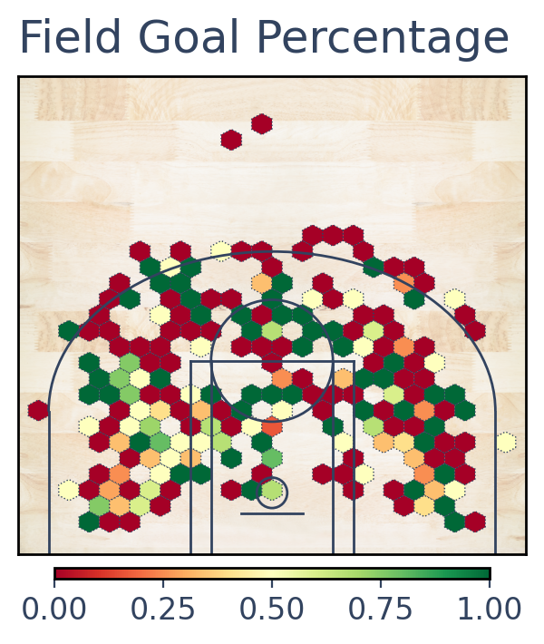
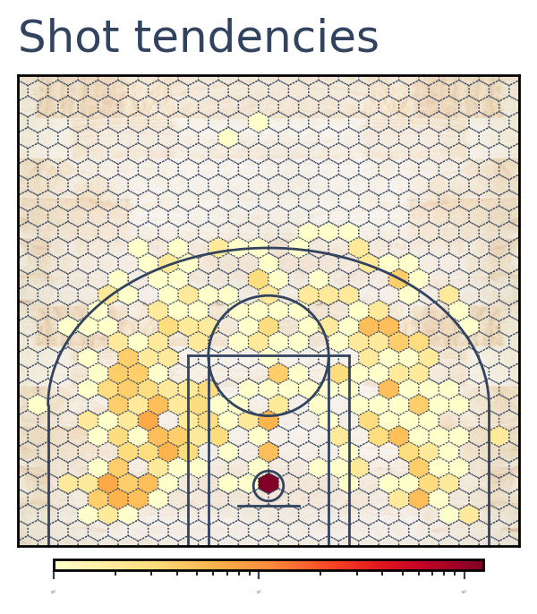
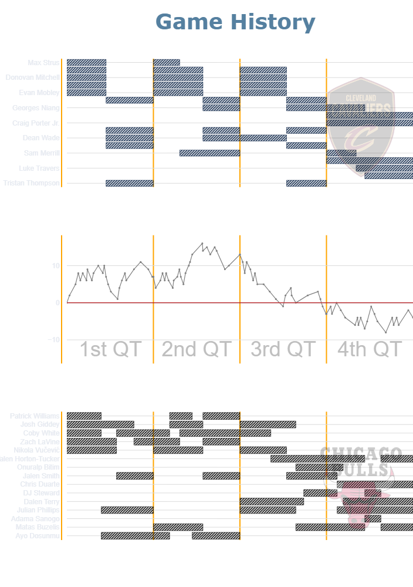

# NBA_streamlit_app

## Summary

The purpose of this Streamlit project is to build a tool that provide observers with visualizations of events.

## Data sources

The data sources are NBA statistics retrieved via an API client for nba.com. See https://github.com/swar/nba_api.

## Contents

### 1. Shot charts

This page provides users with an access to shooting datas through shot charts and a summary table.

Here is an example of a shot chart for Michael Jordan 1997-98 Playoffs :

### 2. Game History

This page enables observers to select a game and quickly view the game's dynamics, including score differential tracking and substitutions.

## Packages

matplotlib.pyplot : https://matplotlib.org/3.5.3/api/_as_gen/matplotlib.pyplot.html

AG Grid : https://docs.streamlit.io/develop/concepts/custom-components

plotly graphic objects : https://plotly.com/python/graph-objects/
